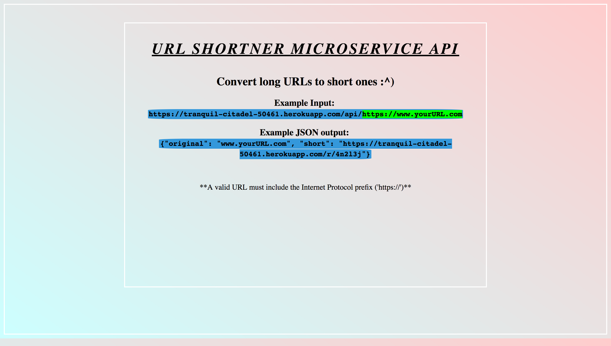
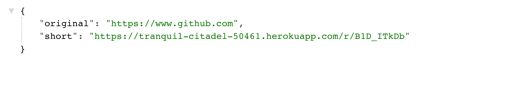

# URLshortener
An API that will take a user entered url and return a shorter url that points to the original url's website. 

**The 'short' URL might not always be shorter than the original because heroku's autogenerated domain 'https://tranquil-citadel-50461.herokuapp.com/' is quite long (45 characters!)**.  

Technologies used:  
Front-end: html,css,javascript  
Back-end: NodeJS, Express, valid-url, shortid  
Database: MongoDB/Mongoose   

